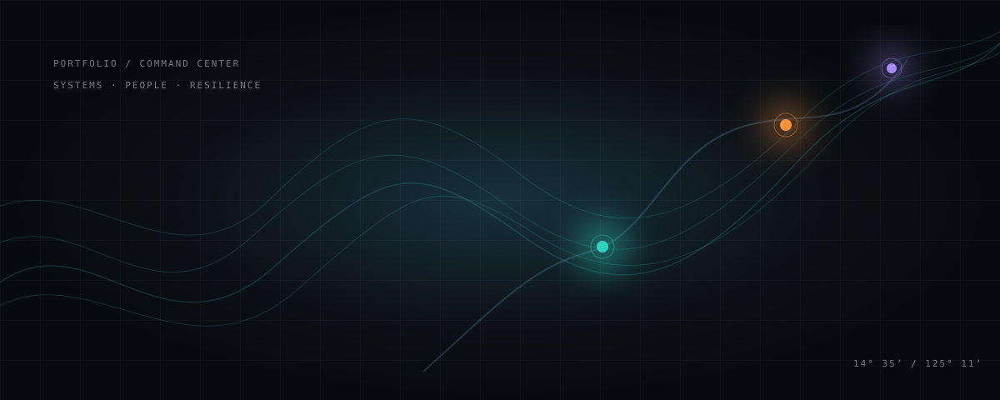

# Jonnywik

> **Full-stack developer building operational software that keeps work moving.**

I build systems where the interface has to do more than look good: it has to clarify the next decision, retain useful state, and behave responsibly when workflows become complex. My current focus spans TypeScript, React, Next.js, Python/FastAPI, and relational data systems.

**[Explore the Portfolio Command Center source](https://github.com/Jonnywik/Jonnywik.github.io)** · **[View GitHub work](https://github.com/Jonnywik)** · **[Trace featured systems](#featured-systems)**

  
  
  
  

## Portfolio telemetry

  
  

> **Live public indicators.** The cards above are supplied by public GitHub-readme services and reflect available public repository metadata. The visitor badge is an external count, not an engagement or quality metric.

## Featured systems

### [Code for Resilience — Command Center](https://github.com/Jonnywik/EnvScie-CommandCenter)

**Disaster-management platform foundation for local emergency operations.** The system brings together a FastAPI/PostGIS backend, a command-center dashboard, and an offline-aware resident mobile experience. It is designed as decision support and development/pilot infrastructure—not as a certified live emergency-service deployment.

`FastAPI` · `PostGIS` · `Next.js` · `React Native` · `Expo` · `WebSockets`

[Read the repository](https://github.com/Jonnywik/EnvScie-CommandCenter) · [Explore the portfolio source](https://github.com/Jonnywik/Jonnywik.github.io)

### [Employee Management Dashboard](https://github.com/Jonnywik/employee-management-dashboard)

**Responsive HR operations workspace for onboarding, attendance, payroll, claims, and employee-facing workflows.** The application keeps process state, approval steps, and audit-oriented exports close to the work teams need to complete.

`TypeScript` · `React` · `tRPC` · `Drizzle` · `MySQL` · `Vitest`

[Read the repository](https://github.com/Jonnywik/employee-management-dashboard) · [Explore the portfolio source](https://github.com/Jonnywik/Jonnywik.github.io)

## How I build

| Principle | What it means in practice |
| --- | --- |
| **Operational clarity** | Interfaces should make state, actions, and consequences easy to understand at a glance. |
| **Resilient workflows** | Connectivity, uncertainty, approval boundaries, and partial failures are product concerns—not afterthoughts. |
| **Responsible systems** | Useful software states its limitations, protects critical decisions, and does not overclaim what it can do. |

## Technology focus

`TypeScript` · `React` · `Next.js` · `Python` · `FastAPI` · `Node.js` · `tRPC` · `PostgreSQL` · `PostGIS` · `MySQL` · `Drizzle ORM` · `Vitest` · `React Native` · `Expo`

## Start here

The **[Portfolio Command Center source](https://github.com/Jonnywik/Jonnywik.github.io)** is the quickest way to inspect the projects, their systems thinking, and the decisions behind the interface. Every feature story links back to its source code and documentation.

---

*A source-first portfolio: real projects, documented boundaries, and evidence over vanity metrics.*
